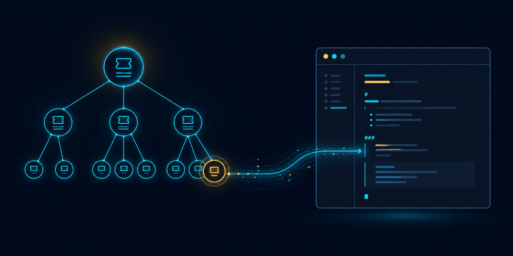

<p align="center">
  
</p>

# jira-context-mcp

[](https://github.com/pdudzinsky/jira-context-mcp/actions/workflows/ci.yml)
[](https://www.python.org/downloads/)
[](LICENSE)
[](https://modelcontextprotocol.io)

Pull rich Jira ticket context into your LLM during development. Three composable MCP tools — one for the surrounding hierarchy, one for a single ticket's full content, one for just the Smart Checklist (ACCs) — render Jira data as structured markdown. Read-only by design, built for developers who read tickets, not manage them.

## The three tools at a glance

| Tool | Question it answers | Output |
|---|---|---|
| `get_issue_tree` | _What's around this ticket?_ | Hierarchy with focus marker — root → leaves, lite info per ticket, status overview |
| `get_ticket_content` | _What's in this specific ticket?_ | Full description + Smart Checklist + optional comments — single ticket only |
| `get_smart_checklist` | _Just the ACCs._ | Just the Smart Checklist — token-efficient when nothing else is needed |

A typical workflow has the LLM call `get_issue_tree` first to discover structure, then drill into specific tickets with `get_ticket_content`. Each tool does one thing; they compose.

## What you get

### `get_issue_tree` example

Given any ticket — leaf, mid, or root — the tool walks **upward** to the topmost ancestor and then **downward** from there, building a tree centered on your ticket. Sample (simplified) output:

````markdown
# Issue tree: PROJ-1234

## Overview

Total: 27 tickets · By type: 1 Epic, 5 Story, 21 Subtask
By status: 24 Gotowe, 2 In QA, 1 Odrzucono

## Tree

```
PROJ-100 · [Epic] Refactor billing module · In Progress
├── PROJ-239 · [Story] Payment retry logic · Done
│   ├── PROJ-1230 · [Subtask] [BE] Retry policy · Gotowe
│   └── PROJ-1231 · [Subtask] [BE] Idempotency keys · Gotowe
├── PROJ-240 · [Story] Extract invoice generation · In Progress
│   ├── PROJ-1233 · [Subtask] [BE] Extract CSV export · Gotowe
│   ├── 🎯 PROJ-1234 · [Subtask] [BE] Add PDF template · In Progress ⬅️ FOCUS
│   └── PROJ-1235 · [Subtask] [BE] Add XML export · To Do
└── PROJ-260 · [Story] Email notifications · To Do
```
````

Notes:
- **Root** is at the top, no marker — its position alone distinguishes it.
- **Path nodes** (the spine from root to focus) get expanded regardless of `depth_down`. Other nodes expand only up to `depth_down` levels — protects against runaway trees on huge epics.
- **Focus** marker (`🎯` + `⬅️ FOCUS`) lands on the ticket you asked about, wherever it sits in the hierarchy.
- **JQL response order** is preserved (no alphabetical re-sort) — matches what you see in Jira UI.
- **Lite per-ticket info** (key, type, summary, status) keeps the output scannable. Use `get_ticket_content` for full descriptions and ACCs.

### `get_ticket_content` example

Full content of a single ticket — description, Smart Checklist (when present), optional comments. No hierarchy walk, no peers.

````markdown
# PROJ-240 · [Story] Extract invoice generation
**Status:** In Progress · **Assignee:** Piotr D. · **URL:** https://your-org.atlassian.net/browse/PROJ-240

## Description
Pull invoice logic out of BillingService into a new InvoiceService.

## Smart Checklist (1/3 done)
### 1. Service alignment
- [x] Service boundary alignment reviewed
- [-] Migration plan drafted
- [ ] Rollout communication to support

## Comments  (only when include_comments=True)
**2026-04-22 14:05, Piotr D.:**
> Started profiling. 80% in CSV writer.
````

### `get_smart_checklist` example

````markdown
# Smart Checklist: PROJ-240 (1/3 done)

## 1. Service alignment

- [x] Service boundary alignment reviewed
- [-] Migration plan drafted
- [ ] Rollout communication to support
````

## Prerequisites

- Python 3.11+
- [`uv`](https://github.com/astral-sh/uv) (`brew install uv` on macOS, [other platforms](https://docs.astral.sh/uv/getting-started/installation/))
- An Atlassian Cloud instance (Jira Server / Data Center are not supported in v0.1)
- An [Atlassian API token](https://id.atlassian.com/manage-profile/security/api-tokens)

## Install

```bash
git clone https://github.com/pdudzinsky/jira-context-mcp.git
cd jira-context-mcp
uv sync
```

`uv sync` creates `.venv/` and installs everything from the committed `uv.lock`. No activation needed — the launchers below use `uv run` which handles it.

## Configure your MCP client

The server needs three environment variables: `JIRA_BASE_URL`, `JIRA_EMAIL`, `JIRA_API_TOKEN`. Provide them either inline in the MCP client config (recommended) or via a `.env` file in the repo (see `.env.example`).

### Claude Desktop (macOS)

Edit `~/Library/Application Support/Claude/claude_desktop_config.json`:

```json
{
  "mcpServers": {
    "jira-context-mcp": {
      "command": "uv",
      "args": [
        "run",
        "--directory",
        "/absolute/path/to/jira-context-mcp",
        "python",
        "-m",
        "jira_context_mcp"
      ],
      "env": {
        "JIRA_BASE_URL": "https://your-org.atlassian.net",
        "JIRA_EMAIL": "you@example.com",
        "JIRA_API_TOKEN": "ATATT..."
      }
    }
  }
}
```

> **Heads-up on tokens:** Atlassian API tokens are ~192 characters of `base64`-ish goo. If you paste one and your line wraps in the JSON editor, whitespace can sneak into the middle of the string — Jira will then silently return 404 on private projects. Paste carefully, or strip the value through `tr -d '[:space:]'` before saving.

Quit Claude Desktop fully (`Cmd+Q`, not just close the window) and reopen. The three tools should appear in the available-tools list.

### Other MCP clients

Any client that supports stdio-based MCP servers works the same way — point `command` at `uv run ... python -m jira_context_mcp` and provide the three env vars. Cursor's `.cursor/mcp.json`, Zed's `settings.json`, and `fastmcp dev` all use the same shape.

### Local `.env` alternative

```bash
cp .env.example .env
$EDITOR .env
```

`.env` is git-ignored. It's loaded when the process is launched with `--directory` pointing at the repo root.

## Usage

### Tool parameters

**`get_issue_tree`**

| Parameter | Type | Default | Notes |
|---|---|---|---|
| `issue_key` | string | required | Any ticket — leaf, mid, or root. |
| `depth_up` | int | `10` | Max levels to walk upward toward the root. Real hierarchies are 2–4 deep. |
| `depth_down` | int | `2` | Max levels to expand below the root. Hard-capped at 3 to prevent runaway expansion on epics with hundreds of descendants. The path to the focus is always shown regardless. |

**`get_ticket_content`**

| Parameter | Type | Default | Notes |
|---|---|---|---|
| `issue_key` | string | required | Single ticket. |
| `include_comments` | bool | `false` | Comments are noisy and token-heavy — opt in when needed. |

**`get_smart_checklist`**

| Parameter | Type | Default | Notes |
|---|---|---|---|
| `issue_key` | string | required | Single ticket. |

### Workflow recipes

Prompt templates for typical developer workflows. Paste any of these into Claude (or any MCP-capable LLM) along with the relevant ticket key — they **force the model to call all three tools in the right order** instead of guessing which one fits the question. Each recipe maps a real situation to a concrete tool sequence.

#### Picking up a ticket from the sprint

You took a leaf ticket (Subtask / Task) and the description is sparse — ACCs likely live on the parent Story. This recipe walks the hierarchy upward and pulls full content for every node above the focus.

> I'm picking up **PROJ-1234** to work on. Use `jira-context-mcp` to:
>
> 1. Call `get_issue_tree(issue_key="PROJ-1234")` to see where this ticket sits in the hierarchy.
> 2. Call `get_ticket_content(issue_key="PROJ-1234")` for my ticket's full detail.
> 3. For each path node above the focus (Story, Epic), call `get_ticket_content` so I see their descriptions and ACCs. The Story usually carries the actual acceptance criteria.
> 4. Summarize: what's the parent goal, what ACCs apply to my work, and what broader context should I keep in mind?

> **Tip:** if a path node returns `Smart Checklist on KEY: not present`, skip it and check the next ancestor. ACCs in Example-style projects sometimes hop a level.

#### Sprint planning — overview of an Epic

Use this to assess scope and progress without pulling per-ticket descriptions for every Story.

> Give me an overview of **PROJ-100** for sprint planning. Use `get_issue_tree(issue_key="PROJ-100", depth_down=2)`.
>
> Then summarize from the Overview block and tree only:
>
> - How many Stories under this Epic, statuses breakdown
> - Which Stories look stalled (In Progress / In QA without subtask completion)
> - Breakdown by BE / FE / QA based on `[BE]` / `[FE]` / `[QA]` markers in subtask titles
> - What's ready to release vs what needs follow-up
>
> Do **not** pull individual ticket descriptions unless I ask — overview only. If I ask follow-up questions about a specific Story, then call `get_ticket_content`.

#### Code review — verifying ACCs are addressed

Useful right before approving a PR linked to a Story or Subtask.

> I'm reviewing a PR linked to **PROJ-1234**. Use `jira-context-mcp` to:
>
> 1. Call `get_issue_tree(issue_key="PROJ-1234")` to find the parent Story (path node above the focus).
> 2. Call `get_smart_checklist(issue_key="<that parent Story>")` — those are the ACCs the PR should satisfy.
> 3. After I paste the diff, walk through each ACC and tell me which ones the diff likely addresses, which look untouched, and which are ambiguous.
>
> Be skeptical — if an ACC says "comment section must be hidable by the user" and the diff has no UI changes, flag it as untouched.

#### Stand-up prep — multiple tickets at a glance

Run this just before daily / weekly to get a quick status sweep across whatever you're juggling.

> Quick status check on what I'm working on. For each of **[PROJ-1234, PROJ-1235, PROJ-1236]**:
>
> - Call `get_ticket_content(issue_key=..., include_comments=False)`
> - Give me one line: ticket key, status, what the description is asking for in 10–15 words
>
> Then call `get_issue_tree(issue_key="PROJ-1234")` once and tell me if anything **else** under that Epic looks blocked or stalled — I want to know if my work has dependencies I missed.

### Example prompts

The LLM picks the right tool based on what you ask:

- _"Show me the tree around PROJ-1234"_ → `get_issue_tree`
- _"What's in this epic? PROJ-100"_ → `get_issue_tree(depth_down=2)`
- _"Tell me about PROJ-240"_ → `get_ticket_content`
- _"Show me PROJ-240 with comments"_ → `get_ticket_content(include_comments=True)`
- _"What are the ACCs for PROJ-240?"_ → `get_smart_checklist`
- _"Walk me through this hierarchy with full descriptions of the parents"_ → `get_issue_tree` followed by `get_ticket_content` on each parent

### Errors

All errors come back as the tool response (a string starting with `Error:`) rather than exceptions:

- `Error: missing required environment variable(s): ...` — credentials not provided
- `Error: invalid Jira configuration — ...` — env vars are set but malformed (e.g. base URL isn't a valid URL)
- `Error: Jira authentication failed. ...` — wrong email/token (or whitespace polluting the token)
- `Error: ticket(s) not found in Jira: PROJ-1234` — typo, deleted, or your token lacks access
- `Error: Jira rate limit exceeded after retries. ...` — back off and retry
- `Error: invalid depth parameter. ...` — `depth_up` was `< 1`
- `Error: hierarchy cycle detected. ...` — parent link loop in Jira (shouldn't happen, but defensive)

### From the shell (no MCP client needed)

Each tool is an async Python function — call it directly with `uv run`:

```bash
# Tree overview
uv run python -c "
import asyncio
from jira_context_mcp.server import get_issue_tree
print(asyncio.run(get_issue_tree(issue_key='PROJ-1234')))
"

# Single ticket full content
uv run python -c "
import asyncio
from jira_context_mcp.server import get_ticket_content
print(asyncio.run(get_ticket_content(issue_key='PROJ-1234', include_comments=True)))
"

# Just the ACCs
uv run python -c "
import asyncio
from jira_context_mcp.server import get_smart_checklist
print(asyncio.run(get_smart_checklist(issue_key='PROJ-1234')))
"
```

Save to a file:

```bash
uv run python -c "
import asyncio
from jira_context_mcp.server import get_issue_tree
print(asyncio.run(get_issue_tree(issue_key='PROJ-1234')))
" > PROJ-1234-tree.md
```

Pipe through a markdown pager like [`glow`](https://github.com/charmbracelet/glow):

```bash
uv run python -c "..." | glow -
```

Quick connectivity / auth check (any tool works; `get_smart_checklist` is the lightest):

```bash
uv run python -c "
import asyncio
from jira_context_mcp.server import get_smart_checklist
print(asyncio.run(get_smart_checklist(issue_key='DEFINITELY-BOGUS-9999')))
"
# Wrong creds → "Error: Jira authentication failed ..."
# OK creds  → "Smart Checklist on DEFINITELY-BOGUS-9999: not present (...)"
```

## Known limitations

- **Comments:** capped at 100 per ticket. If a ticket has more, a WARN is logged to stderr and the first 100 are returned.
- **Jira Cloud only.** No Jira Server / Data Center support.
- **Read-only by design.** No `create_*`, `update_*`, `transition_*` tools — this is intentional.
- **Smart Checklist progress:** for the modern bullet-list format, per-item status lives in sibling Jira properties (`SmartChecklist`, `ItemStatusSearchMeta`) that the parser doesn't currently read. Items default to `"open"`, so the count shows `(N items)` even when some are completed in Jira UI. Legacy task-list markers carried inline (`[x]`, `[-]`, `[~]`) are honored when present. Reading the sibling properties for accurate `(N/M done)` is on the roadmap.
- **`depth_down` is capped at 3.** Asking for more is silently clamped. The focus ticket and its direct ancestors are always reachable in the tree, even when the focus sits below `depth_down` levels (the spine is always expanded).
- **ADF coverage:** the converter handles paragraphs, headings (auto-shifted to nest under the surrounding hierarchy in `get_ticket_content`), lists, code blocks, blockquotes, marks (`strong`/`em`/`code`/`strike`/`link`), hard breaks, mentions, emoji, inline cards (URL extraction), media nodes (`[image]` placeholder), and horizontal rules. Two rarer types — `panel` and `table` — still render as `[unsupported: <type>]`; add a handler in `src/jira_context_mcp/adf.py` if you need them.

## Development

```bash
git clone https://github.com/pdudzinsky/jira-context-mcp.git
cd jira-context-mcp
uv sync
cp .env.example .env  # then edit
uv run python -m jira_context_mcp  # stdio server — blocks waiting for MCP handshake
```

Run the test suite, linter, and type checker:

```bash
uv run pytest          # 171 tests, ~1s
uv run ruff check src tests
uv run mypy
```

Project layout:

```
src/jira_context_mcp/
├── __init__.py
├── __main__.py       # python -m entrypoint
├── server.py         # FastMCP server + 3 tool registrations
├── config.py         # pydantic-settings for env vars
├── models.py         # frozen pydantic DTOs (Ticket, Comment, Checklist, TreeNode, ...)
├── jira.py           # async httpx client + retries + checklist parser
├── tree.py           # walk-up + walk-down hierarchy builder
├── adf.py            # ADF → markdown converter (with heading_offset)
└── markdown.py       # final renderers (tree, content, checklist)
```

## License

[MIT](LICENSE)
